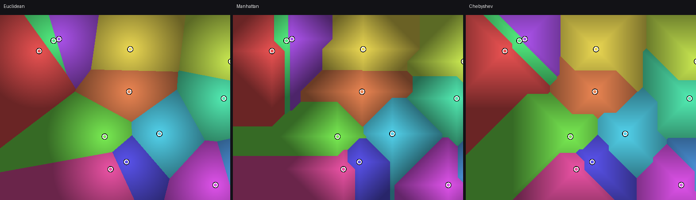
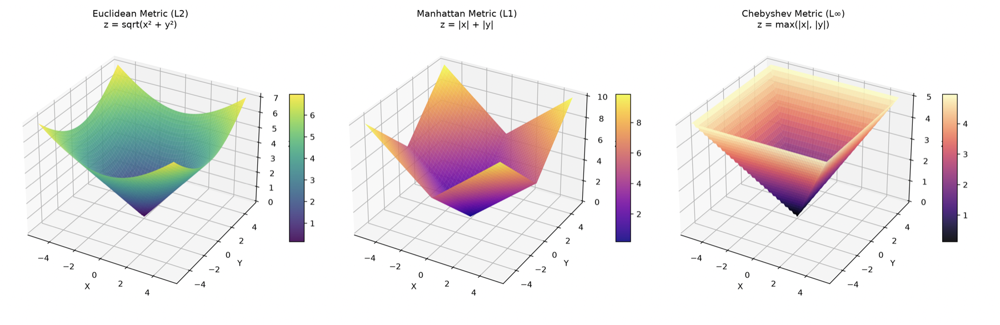

# Project 1 - Voronoi Diagrams
Version 1.0 (Oct 5, 2026)



## Change Log

- Draft 0.1 - initial version, for review before release.

## Introduction

Given a set of distinct points in the plane, called **sites**, the *Voronoi
diagram* of that set partitions the plane into regions, one per site, such
that every point of a region is closer to its own site than to any other.
Formally, given sites $\mathbf{p}_1, \mathbf{p}_2, \ldots, \mathbf{p}_n$, the
**cell** of site $\mathbf{p}_i$ is

$$ V(\mathbf{p}_i) = \{\, \mathbf{x} \in \mathbb{R}^2 \;:\; d(\mathbf{x}, \mathbf{p}_i) \le d(\mathbf{x}, \mathbf{p}_j) \text{ for all } j \ne i \,\} $$

where $d$ is a distance function. The cells cover the whole plane and overlap
only along their boundaries: a boundary point is one equidistant from two or
more sites. When $d$ is the ordinary Euclidean distance, every cell is
convex, and each edge of the diagram is a segment of the perpendicular
bisector between the two sites it separates.

Nothing above requires $d$ to be the Euclidean distance. Any distance
function partitions the plane the same way, into regions of "closest site",
but the shape of the cells depends entirely on which distance is used. This
project asks you to build exactly that: a renderer that computes the
diagram, and lets the choice of distance change everything about it while
the sites themselves stay put.

### Why this matters

Voronoi diagrams show up whenever "which is the nearest one" is the
question. A few examples:

- **Nearest facility problems.** Which hospital, warehouse, or mobile
  antenna is closest to a given point defines a Voronoi cell around each
  facility. Meteorologists have used the same idea for over a century,
  under the name *Thiessen polygons*, to assign the rainfall recorded at a
  handful of weather stations to the area around each one.
- **Motion planning in robotics.** A path that stays as far as possible
  from every obstacle - the safest route through a cluttered room - runs
  along the edges of the Voronoi diagram of the obstacles.
- **Procedural generation and texturing.** Cellular, stone-like textures
  ("Worley noise") are Voronoi diagrams evaluated directly in a shader,
  which is close to what you will be doing here.
- **Natural patterns.** The cracking of dried mud, the arrangement of cells
  in some tissues, and the patches on a giraffe's coat are often described,
  informally, as approximating a Voronoi tessellation - each patch growing
  outward until it meets its neighbours.
- **Mesh generation.** Voronoi diagrams and their dual, the
  [Delaunay triangulation](https://en.wikipedia.org/wiki/Delaunay_triangulation),
  are a standard way of turning a scattered set of points into a well-shaped mesh
  for simulation or terrain rendering.

## Objective

Build a WebGL2 application that renders the Voronoi diagram of a set of
sites the user can add, move and remove, under a choice of three distance
functions, using **two different rendering techniques that must agree on
every pixel**:

1. **Search**, entirely in the fragment shader: for every pixel, measure
   the distance to every site and keep the nearest.
2. **Surfaces and the depth buffer**, entirely in the vertex shader: stand
   over every site a surface whose height is the distance to that site, let
   the GPU's depth test keep the lowest surface at each pixel, and read off
   which site that was.

Both are legitimate ways of answering the same question, "which site is
this pixel closest to?" - one by asking each pixel to search, the other by
never searching at all and instead letting rasterisation and the depth test
do the work. Implementing only the first technique is enough for a
significant part of the grade (see **Evaluation**); implementing both, and
being able to show that they produce the same picture, is worth
substantially more.

## Startup code

The folder `src/prjs/prj1-startup` in the course repository has a starting
point for the project. Copy it to `src/prjs/prj1` and work on the copy -
the same way you copied each `exNN` to `my-exNN` in the labs - so that
pulling later updates to the repository never collides with your own work.

It already sets up a canvas that fills the whole browser window and keeps
filling it when the window is resized, and draws a single quad - two
triangles - covering the entire viewport, with a fragment shader that
paints it one fixed colour. That quad is the starting point for the search
technique below. The mouse, wheel and keyboard events are already wired to
empty functions at the top of `app.js` (`on_mouse_down`, `on_mouse_move`,
`on_mouse_up`, `on_wheel` and `on_key`, the last one already listing the
keys from **Controls**), which is where your interaction code goes.
Everything else - sites, distances, pan, zoom and both rendering
techniques - is yours to write.

## Sites

- A site has a 2D position and a colour, assigned when it is created.
- **Left-click** on  canvas adds a new site at the pointer, with a
  colour of your choosing (for example, cycling through a fixed palette or
  picking one at random).
- **Dragging an existing site** moves it; the diagram must update live
  while it is being dragged, in both rendering techniques.
- **Dragging  canvas** pans the view instead of adding a site. Since
  both actions start with a `mousedown` on  canvas, you need a rule to
  tell them apart: a natural one is to wait until the pointer has moved more
  than a few pixels before committing to a pan, and to add a site on
  `mouseup` only if it never did.
- Pressing **'x'** removes the site nearest the pointer.
- The **scroll wheel** zooms in and out, centred - at minimum - on the
  middle of the canvas.
- Support at least 32 sites simultaneously. Going well beyond that is a
  reasonable stretch goal, but see **Program limits** below for the design
  implication.

## Distance metrics

Implement at least the following three distance functions between two
points $\mathbf{p}=(p_x,p_y)$ and $\mathbf{q}=(q_x,q_y)$, switchable live
with keys **'1'**, **'2'** and **'3'**:

$$
d_{\text{Euclidean}}(\mathbf{p},\mathbf{q}) = \sqrt{(p_x-q_x)^2 + (p_y-q_y)^2}
\qquad
d_{\text{Manhattan}}(\mathbf{p},\mathbf{q}) = |p_x-q_x| + |p_y-q_y|
$$

$$
d_{\text{Chebyshev}}(\mathbf{p},\mathbf{q}) = \max(|p_x-q_x|,\, |p_y-q_y|)
$$

Switching the metric must visibly and correctly change the *shape* of the
cells - straight bisectors for Euclidean, a staircase-like boundary for
Manhattan, diagonal boundaries for Chebyshev - not just recolour the same
regions. The same metric must be used consistently by both rendering
techniques at any given moment: this is one of the two things that has to
match when you compare them (the other being where the sites are).

**Cell borders.** In the search technique, a pixel lies on a border when
its distance to the nearest site is nearly equal to its distance to the
*second*-nearest one:

$$ \text{border} \iff |\,d_1 - d_2\,| < \varepsilon $$

for some small $\varepsilon$ that should scale with how zoomed in the view
is (a fixed world-space $\varepsilon$ will look wrong at every zoom level
except the one it was tuned for). Rendering borders is required.

## Rendering technique 1: search (fragment shader)

Cover the canvas with a single quad (two triangles, or one triangle large
enough to contain the viewport - your choice). In the fragment shader, for
every pixel:

1. Convert the pixel's position to your world coordinate system.
2. Loop over every active site, computing its distance under the current
   metric, and keep track of the smallest ($d_1$) and second smallest
   ($d_2$) distances found, and which site produced $d_1$.
3. Colour the pixel with that site's colour, darkened or shaded by $d_1$ if
   you want (optional, but a nice touch - see the sample image), and drawn
   white (or otherwise highlighted) if it is a border pixel by the test
   above.

This technique has no ceiling on the number of sites other than a loop
bound and how many uniforms you use to describe them - see **Program
limits**.

## Rendering technique 2: surfaces and the depth buffer (vertex shader)

This technique needs a vertex shader that builds its own geometry instead
of reading it from a buffer - something the lab exercises never asked of
you, so it is worth explaining here rather than assuming it is familiar.
GLSL gives every vertex shader invocation two predefined integers it can
read without declaring anything: `gl_VertexID`, which vertex of the current
draw call this is, and `gl_InstanceID`, which instance of it (0 if you are
not using instanced drawing). A fan of 64 vertices drawn 32 times over -
once per site, using
[`gl.drawArraysInstanced()`](https://developer.mozilla.org/en-US/docs/Web/API/WebGL2RenderingContext/drawArraysInstanced)
with an instance count of 32 - gives each of those 64 × 32 shader
invocations a `gl_VertexID` from 0 to 63 and a `gl_InstanceID` from 0 to
31, with no attribute and no buffer involved at all: `gl_InstanceID` tells
the shader which site it is building a surface for, and `gl_VertexID`
tells it which point of that surface's rim this particular vertex is -
everything else (looking up that site's position and colour, computing
the point of the rim) follows from arithmetic on those two numbers alone,
against whatever uniform arrays you use to describe your sites (see
**Program limits** below).

For each site, generate a surface this way, with no data read from a
buffer, whose height above the plane at any point equals the distance from
that point to the site, under the *currently selected metric*. Draw all
these surfaces with the depth test enabled. At every pixel, the surface
that ends up visible is the one with the smallest height there, which is,
by construction, the nearest site - found without a single distance
comparison happening anywhere in your fragment shader.

The shape of the surface **is** the distance function:

- **Euclidean** distance is the same in every direction, so its surface is
  a **right circular cone**. A real cone cannot be drawn exactly with a
  finite number of vertices; approximate it with a many-sided fan (64 or
  128 sides is plenty for the cell boundaries to look smooth) and be honest
  in your report about it being an approximation.
- **Chebyshev** distance is constant along the sides of a square centred on
  the site, so its surface is a **square pyramid** - four sides, and no
  approximation at all: it is exact.
- **Manhattan** distance is constant along the sides of a diamond (a square
  rotated 45°) centred on the site, so its surface is a **four-sided
  pyramid over that diamond** - also exact.



That the two "straight-edged" metrics need only four vertices to be
rendered *exactly*, while the round one is necessarily approximate, is
worth noticing and worth a sentence in your report.

Some practical points:

- The surface must reach far enough that it always covers the visible
  canvas, however far the view is zoomed out or however the window is
  resized - otherwise cells near the edge of a large canvas will be missing
  their surface and something else (or nothing) will show through.
- Borders are not required in this technique (finding the *second* nearest
  surface is not something the depth test gives you for free - a hybrid
  extra-credit approach exists; see **Possible Challenges**).
- Remember to clear the depth buffer every frame, and to disable depth
  testing again for anything you draw afterwards that should not
  participate in it (the site markers, for instance).

## Verifying the two techniques against each other

Provide a way to see both renderings at once - a split view (vertex-mode
result on one half of the canvas, fragment-mode result on the other) is
the simplest, but a fast toggle between the two is also acceptable. **The two must
produce the same picture for the same sites and the same metric.** This is
not just a presentation feature: it is your own correctness check. If the
two disagree, one of them has a bug, and you will see exactly where on the
canvas it is happening.

## Program limits and technical specification

The maximum number of sites your program supports must be a constant that
appears in exactly two places in your code: once in the application's
JavaScript, and once in the GLSL source of each shader that reads the site
array. A structure along these lines is suggested for the uniforms (adapt
freely - this is not a required naming scheme):

```glsl
const int MAX_SITES = 32;

uniform vec2  u_site_position[MAX_SITES];
uniform vec3  u_site_color[MAX_SITES];
uniform int   u_n_sites;      // how many of MAX_SITES are actually in use
uniform int   u_metric;       // 0 Euclidean, 1 Manhattan, 2 Chebyshev
```

If you find yourself wanting substantially more than a few dozen sites,
uniform arrays are the wrong tool - reaching a few thousand sites means
moving the per-site data out of uniforms and into per-instance vertex
attributes instead. That is well beyond
what this project requires, but it is worth knowing the ceiling exists
before you hit it by surprise close to the deadline.

The application window can be resized by the user at any time, and the
canvas must always occupy the full browser window. All the usual
consequences apply: the aspect ratio must be corrected for so that circles
stay circles (this matters more than usual here, since a stretched
Euclidean cell is very easy to spot), and the zoom and pan you implement
must keep working sensibly across a resize.

## Controls

| Input | Effect |
|---|---|
| Click empty canvas | Add a site |
| Drag a site | Move it |
| Drag empty canvas | Pan the view |
| Scroll wheel | Zoom |
| `1` / `2` / `3` | Euclidean / Manhattan / Chebyshev distance |
| `b` | Toggle cell borders |
| `x` | Remove the site under the pointer |
| `m` | Switch between the two rendering techniques / split view |

These keys are fixed, not suggestions: a teaching assistant grading your
submission will use exactly this list, so do not reassign any of them to
something else. `m` only needs to do something once you have implemented
the second rendering technique - before that, it can be a no-op. You are
free to add further keys of your own for any bonus features you implement,
documented in your submission.

## Evaluation

The project is graded out of **20 points**, split over the following four
topics:

1. **The search technique**: Euclidean distance, adding, moving and
   removing sites, pan, zoom, and window resizing handled correctly.
2. **All three distance metrics**, each correctly changing the shape of the
   cells, with borders.
3. **The surfaces-and-depth-buffer technique**, for at least the two exact
   metrics (Chebyshev and Manhattan), shown by a split view or equivalent to
   agree pixel-for-pixel with the search technique.
4. **The Euclidean cone**, completing the surfaces technique with a visibly
   smooth approximation.

The **Possible Challenges** below are optional and are not needed for the
full 20 points.

## Recommended work plan

The project is released on **Monday, October 5** and due on **Sunday,
October 25** - three weeks. A pace that tends to work well:

**Week 1 - sites and interaction.** Before any cell is coloured, get the
sites themselves right: a data structure holding position and colour for
each, drawn as simple markers, with click to add, drag to move, a key to
remove, pan on empty canvas, and zoom on the wheel, plus the window-
resizing and aspect-ratio handling you will need for the rest of the
project anyway. None of this depends on distance functions or shaders
doing anything clever yet - it is straightforward interactive-application
work, and getting it solid first means you debug it once, in isolation,
rather than at the same time as your first shader.

**Week 2 - the search technique and the metrics.** Now colour the cells:
a full-screen quad, and a fragment shader that measures every site's
distance to each pixel and keeps the nearest, first for Euclidean
distance, then Manhattan and Chebyshev, switchable live. Confirm the cell
shapes actually change with the metric (this is easy to get subtly wrong
- a quick sanity check is that the Chebyshev diagram of two sites is a
diagonal line, not vertical or horizontal). Add border detection using the
second-nearest distance. By the end of this week your application should
be feature-complete for everything except the second rendering technique.

**Week 3 - surfaces and verification.** This is the demanding part, so do
not leave it to the last two days. Start with the Chebyshev pyramid - it
is exact and only needs four rim vertices, which makes it the easiest of
the three to get right and to debug. Once it works, Manhattan is the same
idea with the rim rotated 45°. Euclidean, the polygonal cone, is
conceptually the simplest of the three but is where approximation error
can creep in, so leave it for last. Build your split-view (or toggle)
comparison as soon as you have any surface rendering at all - it will
save you time by catching your own bugs early rather than at the end.

## Possible Challenges

- **A general Minkowski metric.** Euclidean, Manhattan and Chebyshev are
  three points on a continuum, $d_p(\mathbf{p},\mathbf{q}) = (|p_x-q_x|^p +
  |p_y-q_y|^p)^{1/p}$, with Manhattan at $p=1$, Euclidean at $p=2$, and
  Chebyshev as the limit $p \to \infty$. Add a control that sweeps $p$
  continuously and watch the cells morph between the three shapes you
  already have.
- **Animated sites.** Have sites drift, and confirm the diagram - and the
  agreement between your two techniques - holds up under continuous
  motion, not only in still frames.
- **Performance comparison.** Measure and report frame time for both
  techniques as the number of sites grows. The two scale differently, and
  saying why, in terms of what each technique actually does per pixel, is
  worth more than the numbers alone.
